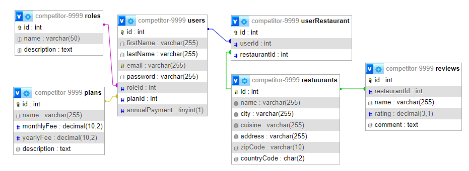

# Module A - DineEase Backend

## Description of the Module
In this module, you need to create the prototype of the backend of the DineEase service. The backend will provide data to the admin application managed by the DineEase staff, and the web application will provide the service.

The data served by the backend is stored in a MySQL database. The database is accessed at db.dineease.com, port 3306, with the username and password provided. The database name is `competitor-YYYY`, where `YYYY` is the four-digit pin.

The database is currently empty. Use the given SQL dump in `assets/module-a/dineeasy.sql` to import the data.

## Backend Task

You must create several endpoints, which will be available at the base URL `http://competitor-YYYY-module-a.dineease.com/api/v1`,  where `YYYY` is your four-digit pin.

The technical details of the endpoints implemented by the backend are contained in the [`assets/module-a/dineease.yaml`](assets/module-a/dineease.yaml) file in OpenAPI format. 

### Users

In the DineEase staff admin interface, it is possible to list restaurant owner users as well as activate and deactivate the user.
To do this, you need to create three endpoints:

- get brief data of all users 
- get detailed information about a selected user
- disable or activate a user

### Restaurants

In the admin interface, you need to list the restaurants. To do this, you need to implement the following endpoint:

- get all restaurants by averaging the ratings (reviews) for each restaurant

### Plans

Also, DineEase staff can modify subscription plans in the admin app. To do this, the following functionality must be provided:

- get the data of all plans
- update a selected plan

### Roles

The user roles cannot be changed in the admin interface, but you may need the role details. To do this, you need to create just one endpoint.

- get the data of all roles

### Reviews

In the admin app, restaurant reviews can be displayed, and unwanted entries can be deleted. To do this, you need to create two endpoints:

- get all reviews with brief data (name and city) about the corresponding restaurant, sorted backwards by date of entry
- delete a selected review

### Registration

On the DineEase website, restaurant owners can register by entering their personal details and those of the restaurant or restaurants they serve. In addition, during the registration process, they also indicate which subscription plan they choose.

- Post a registration that creates a new restaurant owner user, sets up the selected subscription plan and creates one or more restaurant records.
- Please mind the validation, including not accepting more restaurants than allowed in the selected plan.

### Fully functional backend solution

We provide a fully functional solution for the backend that you can use for testing. The backend solution that uses your database is 
https://competitor-yyyy-solution.dineease.com, where YYYY is your four-digit pin code.

There is an extra endpoint which can reset the database to the original state: POST /api/v1/db-reset