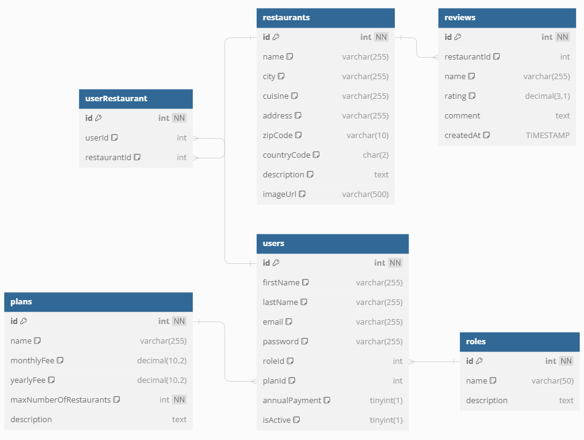

# Module A - DineEase Backend

## Description of the Module
In this module you need to create the prototype of the backend of the DineEase service. The backend will provide data to the admin application managed by the DineEase staff and to the web application providing the service.

The data served by the backend is stored in a MySQL database. The database is accessed at db.dineease.com, port 3306, with the username and password provided.  The name of the database is `competitor-YYYY`, where `YYYY` is the four-digit pin.

The database is currently empty. Use the givem SQL dump in `assets/module-a/dineeasy.sql` to import the data.

<!-- ## Data Conversation Task
Before building the backend, the company wants to test your data management skills in a separate exercise. An `assets/module-a/allUsers.json`file contains the data of all registered users. If a user is a restaurant owner, his record contains his registered restaurants and the restaurant records contain the ratings given to the restaurant. Based on allUsers.json, create separate json files corresponding to the entities in the database with the following names: 
- restaurants.json
- reviews.json
- users.json
- roles.json
- plans.json
Store these files in the `/jsons` folder of your backlend repo. -->

## Backend Task

You will need to create several endpoints, which will be available at the base URL `http://competitor-YYYY-module-a.dineease.com/api/v1`,  where `YYYY` is your four-digit pin.

The technical details of the endpoints implemented by the backend are contained in the `assets/module-a/dineeasy.yaml` file in OpenAPI format. 

### Users

In the DineEase staff admin interface, it is possible to list restaurant owner users as well as activate and deactivate the user.
To do this, you need to create three endpoints:

- get brief data of all users
- get detailed information about a selected user
- disable or deactivate a user

### Plans

Also in the admin app, DineEase staff can modify subscription plans. To do this, the following functionality must be provided:

- get the data of all plans
- update a selected plan

### Roles

The user roles cannot be changed in the admin interface, but you may need the role details. To do this you need to create just one endpoint.

- get the data of all roles

### Reviews

Az admin appban a az éttermek review-jai is megjeleníthetők, illetve a nem kívánatos bejegyzések törölhetők is. Ehhez kát endpointot kell létrehoznod:

- get all reviews with brief data (name and city) about the corresponding restaurant, sorted backwards by date of entry
- delete a selected review

### Registration

On the DineEase website, restaurant owners can register by entering their personal details and those of the restaurant or restaurants they serve. In addition, during the registration process, they also indicate which subscription plan they choose.

- Post a registration that creates a new restaurant owner user, sets up the selected subscription plan and creates one or more restaurant records.

