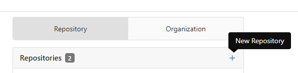
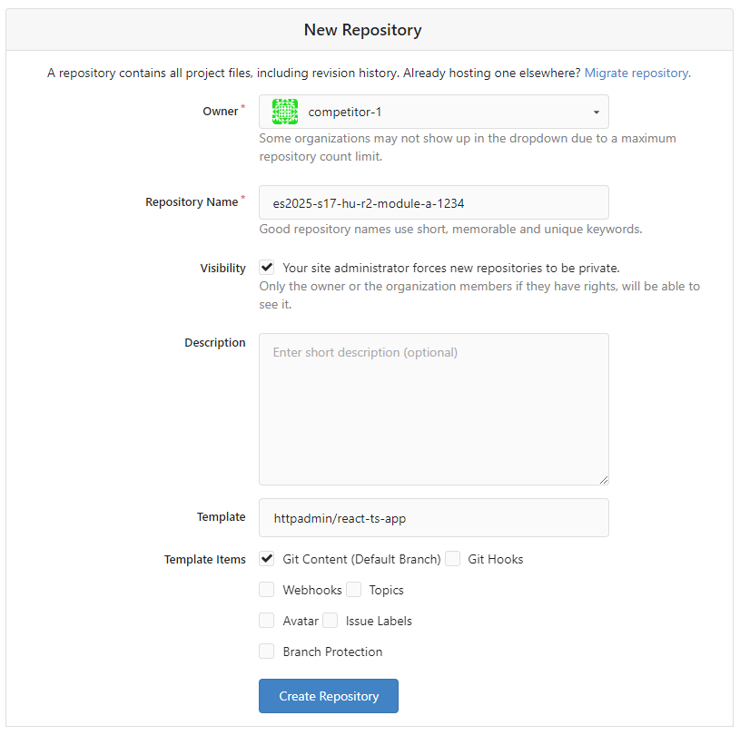

# Modules Overview
**EuroSkills Herning 2025 Hungarian National Competition, Web Development - Round 2** 

Submitted by: [Skills IT](https://skillsit.hu)

## Introduction:

**DineEase**, a small startup based in Hungary, initially made waves in the restaurant industry with their innovative restaurant software. Now, they are expanding their horizons with a brand new service that aims to revolutionize how people discover, explore, and engage with restaurants. In the DineEase all-in-one portal visitors can choose between restaurants, view the full menu of any restaurant, read reviews from previous guests about the restaurant service and food. They can also book a table at the restaurant of their choice and order and pay through the website or the app.

You used to work as a freelance web developer, but now you've applied for a job as a developer at DineEase. The company's management wants to test your skills, so as part of the recruitment process, they asked you to develop the prototype of their new service. You have already successfully completed the first round of the recruitment process, and by creating a prototype for the DineEase showcase website, you have been selected from over 100 candidates to the second round, where only the top six candidates are left.

In this round you will have three different tasks. First you have to create a backend with several REST API endpoints to serve the DineEase frontend apps, then you will develop an admin app which will be used by the DineEase staff. Your final task is to develop a new version of the showcase website.

Descriptions of the three tasks:

- [Modules A - DineEase Backend](module-a.md)
- [Modules B - DineEase Admin](module-b.md)
- [Modules C - DineEase Admin](module-c.md)

## Technical Environment

You can solve the tasks by doing the development on your own machine. 

### Gitea, git

For all three tasks, you can start with the selected template repo available on DineEasy Gitea.

The Gitea service is available at the following address:
[https://gitea.dineease.com](https://gitea.dineease.com)

To log in, you must use the username and password you have been given.
After logging in, create a new repo for the next task. 

- In the Owner field, select competitors team! **Make sure you set this option carefully, because if you set your own user as owner, the automatic deployment will not work!** 
- On the form write the name of the new repo using the following pattern: `es2025-s17-hu-r2-module-a-YYYY`, where `YYYY` is the 4-digit pin code you received.
- Under the template field, select the appropriate template (e.g. `react-ts-app`). Select `Git Content (Default Branch)` for `Template Items`.

Once the new repo is created, clone it to your own workstation inside the `d:\es2025-s17-r2` folder.

### Using npm modules

The npm modules will be accessible via a local npm cache. This means that even though there will be no internet access to the machines, you will be able to add the available npm modules to the projects as usual, and the `npm install` command issued on the cloned template projects will install all the npm modules needed for your project. 

The available npm modules:

- express
- mysql
- mysql2
- vue-router
- react-router
- react-router-dom
- axios
- sass
- tailwindcss

### Laravel projects, composer install

The Laravel project contains all the necessary files, so you will not need to `composer install`. Your workstation has PHP 8 installed, so you can use the `php artisan` commands in the Laravel project.

### Deployment

When you commit and push your work, the deployment will start automatically. You can follow the process in the Gitea interface under the Action tab. Once the deployment is complete, your project will be available at http://competitor-YYYY-module-x.dineease.com, where `YYYY` is your four-digit pin code and `x` is the letter of the module.

### Database access

You will have your own database on the MySQL database server (`db.dineease.com`) available on the local network. You will need to use this database for development, and the same database will provide the data for your projects deployed to the server. A database dump will be provided to provide the the initial data. During the marking, the database will be restored to its original state using the same dump.

